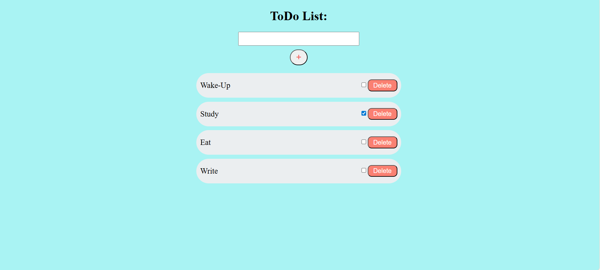

# Todo List App (React + Vite)

A simple and responsive **Todo List application** built using **React** and **Vite**.  
This project demonstrates state management in React and allows users to add, delete, and mark tasks as complete.

---

## 🚀 Features
- Add new tasks
- Mark tasks as completed
- Delete tasks
- Persistent UI with a clean layout

---

## 🛠️ Tech Stack
- **React** (Frontend library)
- **Vite** (Fast bundler & dev server)
- **CSS** for styling

---

## 📸 Screenshots


---

## ⚡ Installation & Setup

1. Clone the repository
   ```bash
   git clone https://github.com/BhanuPrakash-Guniganti/vite-project.git
